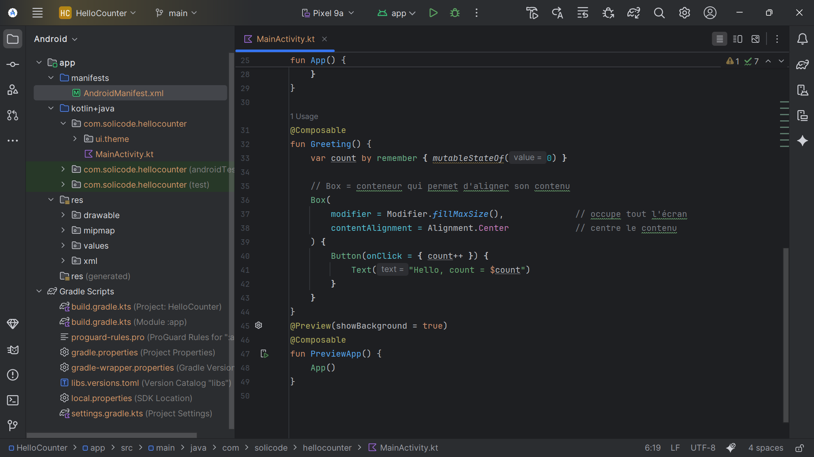

# Android Studio Project Setup

## Deliverable 1: Screenshot of the Android Studio Tree

This deliverable shows the **project structure** inside Android Studio.

### Steps to Capture the Screenshot

1. Open the project in **Android Studio**.
2. Go to the **Project Tool Window** (usually on the left side).
3. Select the **Android** or **Project** view from the dropdown at the top.
4. Expand the **`app/`** module to show:
   - `src/main/java/...` (with `MainActivity.kt`)
   - `src/main/res/values/strings.xml`
   - `src/main/AndroidManifest.xml`
   - `app/build.gradle.kts`
5. Take a screenshot of this tree view.

### Example
*(Tree_structur_image.png)*

---

## Notes
- The screenshot demonstrates that the project contains the required structure for the assignment.  
- Later deliverables (Manifest, `strings.xml`, `build.gradle.kts`) build on this setup.
